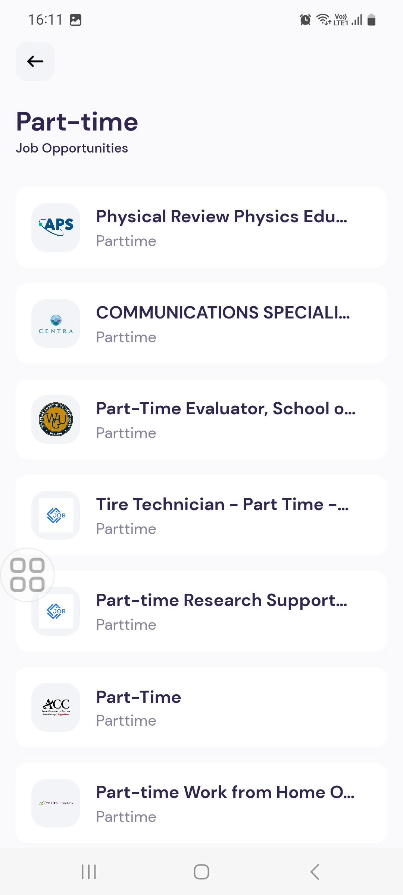

# Job Search

Simple Job Search for jobs posted on LinkedIn, Indeed, Glassdoor, ZipRecruiter, BeBee and many others.




**Technologies**:

- [React Native](https://reactnative.dev/)
- [Expo](https://expo.github.io/router/docs/)
- [Rapid API](https://rapidapi.com/)
- [SWR](https://swr.vercel.app/)

## Features

- [x] Job list
- [x] Job details
- [x] Search functionality
- [x] Pagination
- [x] API caching

Use [`expo-router`](https://expo.github.io/router) to build native navigation using files in the `app/` directory.

## 🚀 How to use

```sh
npx create-react-native-app -t with-router
```

## 📝 Notes

- [Expo Router: Docs](https://expo.github.io/router)
- [Expo Router: Repo](https://github.com/expo/router)
- [Request for Comments](https://github.com/expo/router/discussions/1)
